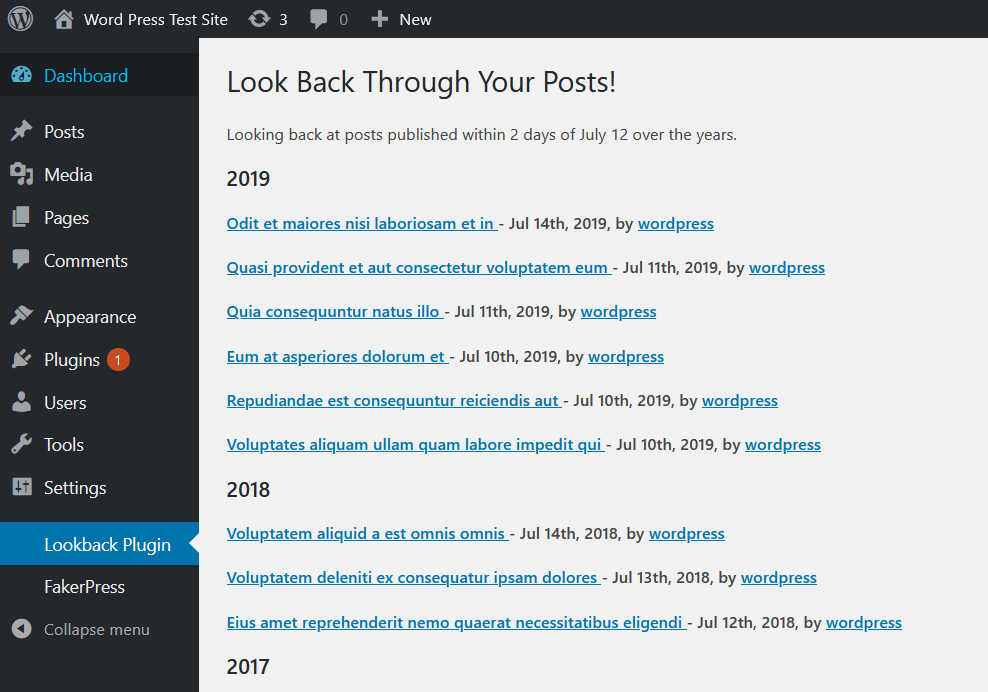

## Lookback Plugin

This WordPress plugin allows you to look back on posts published around the same date in previous years.

# Installation

Just create the folder `/wp-content/plugins/lookback` in your WordPress installation and copy all the PHP files from this repository to the folder.
